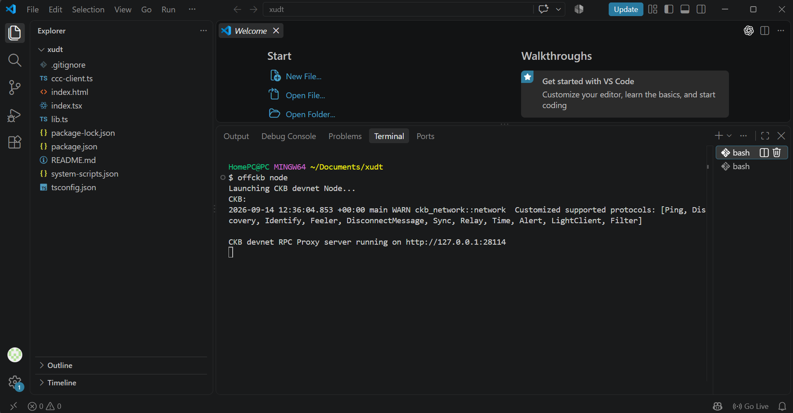
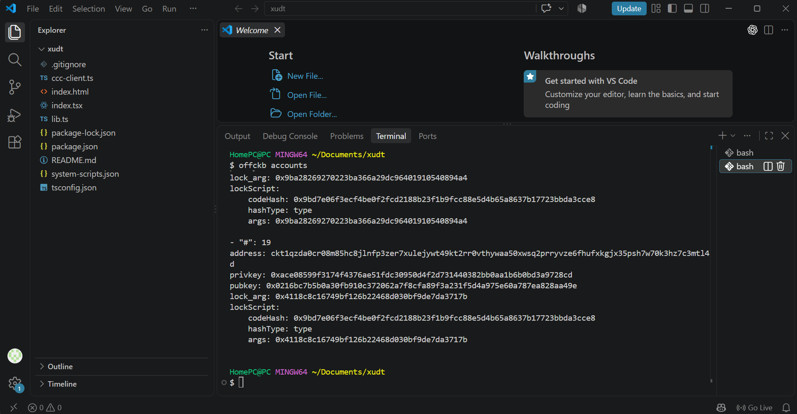
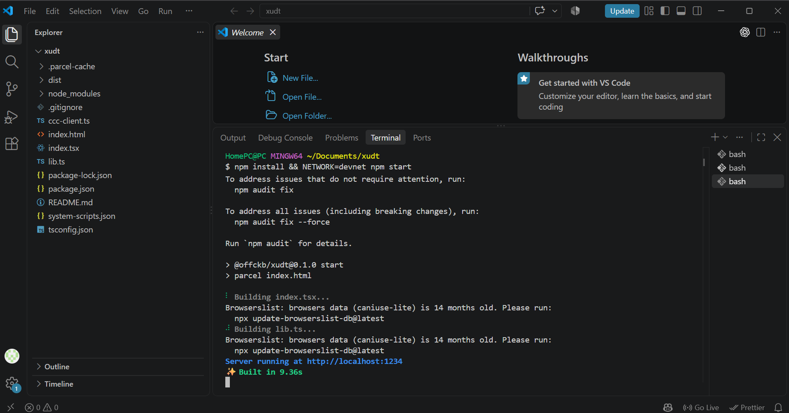
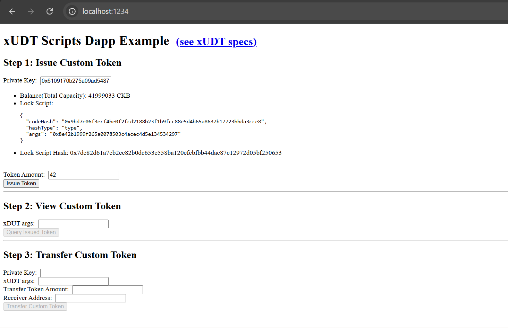
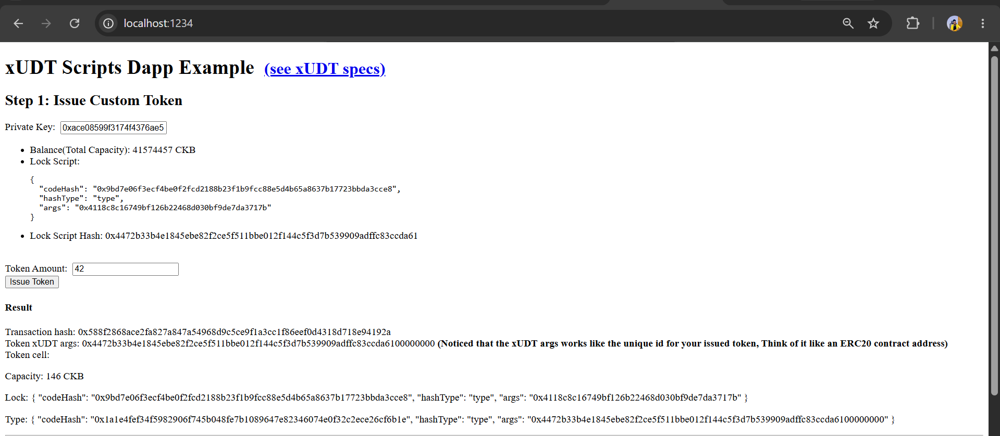
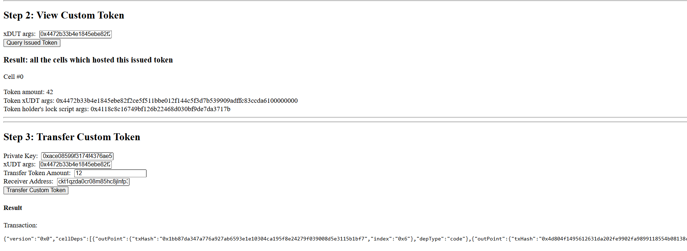
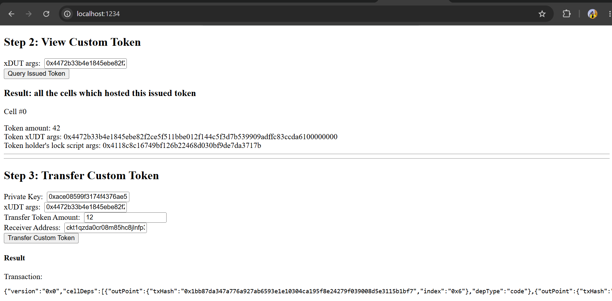

# xUDT Scripts dApp Example

This project is a simple React + TypeScript dApp for creating, checking, and transferring custom xUDT tokens on a local CKB devnet. It uses [`@ckb-ccc/core`](https://github.com/ckb-ccc/ccc) and follows the [xUDT specification](https://github.com/XuJiandong/rfcs/blob/xudt/rfcs/0052-extensible-udt/0052-extensible-udt.md#xudt-witness).

> This demo is intended for local development and testing only. Please only use the private keys and addresses generated by OffCKB's devnet accounts.

## Overview

This application demonstrates how a browser-based wallet workflow can be used to interact with xUDT tokens in a local blockchain environment. The interface is organized into three main actions:

1. **Issue Custom Token** — create a new xUDT token cell from an OffCKB account and display the resulting transaction hash and token arguments.
2. **View Custom Token** — query the local chain for all cells associated with the issued token.
3. **Transfer Custom Token** — send part of the token balance to another devnet address.

## Prerequisites

Before starting, make sure you have:

- Node.js and npm installed
- [OffCKB](https://github.com/ckb-devrel/offckb) installed and available as `offckb`
- A shell that supports the `NETWORK=devnet` environment variable syntax, such as Git Bash

## Setup and Local Deployment

### 1. Start the local CKB devnet

Open a separate terminal and run:

```bash
offckb node
```

The devnet RPC proxy should be available at `http://127.0.0.1:28114`.



### 2. Generate test accounts

Run the following command to create sample devnet accounts. Keep the generated addresses and private keys somewhere safe, as they will be used during testing:

```bash
offckb accounts
```



### 3. Install dependencies and launch the dApp

From the project directory, run:

```bash
npm install
NETWORK=devnet npm start
```

The app will be served locally at [http://localhost:1234](http://localhost:1234).



## Using the dApp

### Step 1: Issue a custom token

1. Enter a private key from `offckb accounts`.
2. Set the amount to `42`.
3. Click **Issue Token**.
4. Copy the generated **Token xUDT args**. This value identifies the issued token and is required in the next steps.



 

### Step 2: View the token cells

1. Paste the xUDT args obtained in Step 1 into the **xUDT args** field.
2. Click **Query Issued Token**.
3. Review the matching token cells, including the token amount, xUDT args, and the holder lock script args.



### Step 3: Transfer the token

1. Enter the sender's OffCKB private key.
2. Paste the same xUDT args.
3. Enter the transfer amount.
4. Provide the receiver's devnet address.
5. Click **Transfer Custom Token** and inspect the resulting transaction.



## Project Scripts

| Command | Description |
| --- | --- |
| `npm start` | Start the Parcel development server |
| `npm run build` | Create a production build in `dist/` |
| `npm run lint` | Run the TypeScript check without emitting files |

## References

- [Create a token on CKB](https://docs.nervos.org/docs/dapp/create-token)
- [xUDT specification](https://github.com/XuJiandong/rfcs/blob/xudt/rfcs/0052-extensible-udt/0052-extensible-udt.md#xudt-witness)